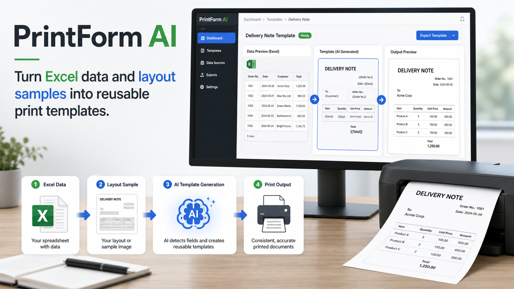
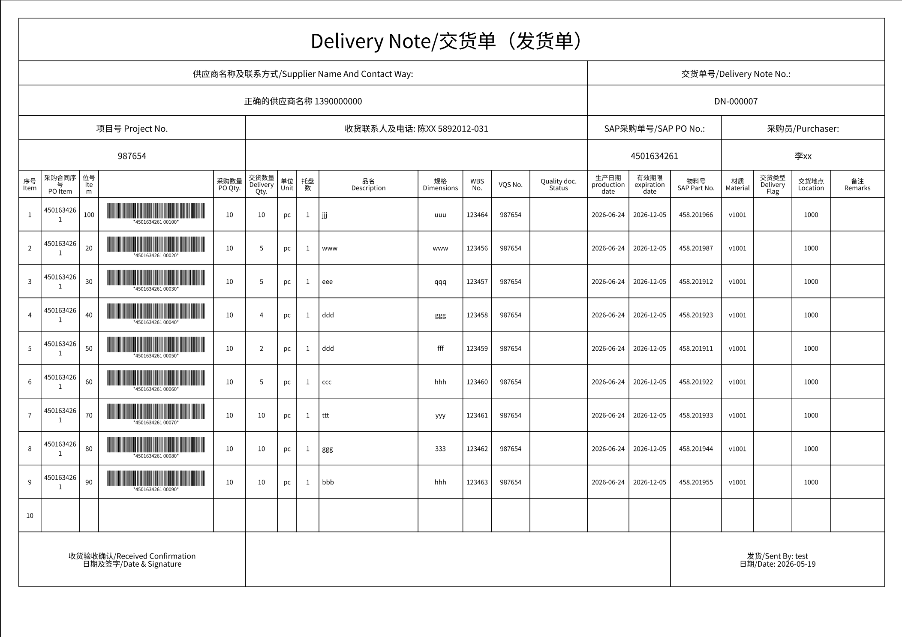
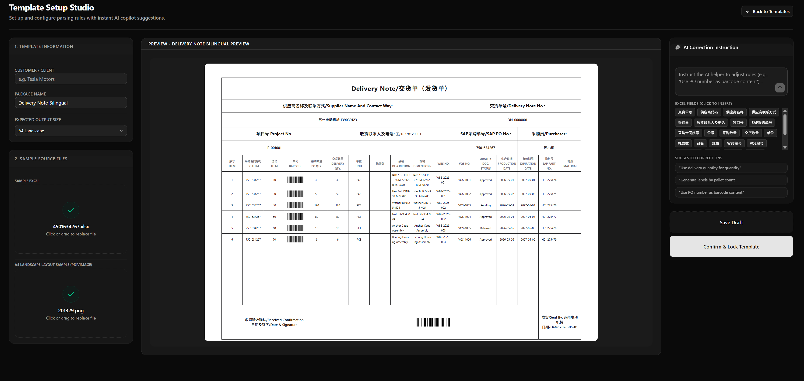

# PrintForm AI



PrintForm AI is a Next.js application for turning customer print requirements into reusable printing templates.

The main workflow is:

1. Upload a sample Excel file so the system can understand the available data columns.
2. Upload a target layout image or template screenshot that represents the desired printed output.
3. Let AI analyze the layout and generate a print-ready HTML template.
4. Lock the template package.
5. For future print runs, select the locked template, upload a new Excel file, preview the generated document, and print.

## Example

Sample target layout uploaded by the user:



AI-generated print preview from the uploaded layout and Excel data:



## Core Features

- Template Setup Studio for creating customer-specific print templates.
- Excel parsing for `.xlsx`, `.xls`, and `.csv` files.
- AI layout analysis from uploaded image samples.
- Print-safe HTML template generation for A4 documents and custom labels.
- Locked template packages for repeatable production printing.
- Daily Print Workspace for uploading new Excel data against an existing template.
- Barcode generation with Code39 as the default barcode type.
- Supabase-backed template storage and print session logging.

## Current Workflow

### 1. Create a Template

Open `/templates/new`.

- Enter the customer and package name.
- Select the expected output size: `A4 Portrait`, `A4 Landscape`, or `Custom Size`.
- Upload the sample Excel file first.
- After the Excel has been parsed, upload the target layout image.
- Review the generated preview.
- Save the template as a draft or confirm and lock it.

The layout upload is intentionally disabled until the sample Excel file has been uploaded. This prevents the AI from analyzing a layout without knowing the available data columns.

### 2. Print with a Locked Template

Open `/print`.

- Select a locked template package.
- Upload the production Excel file.
- Review parsed rows, document counts, label counts, and generated previews.
- Print the A4 document or custom label output.
- The print session is logged to Supabase.

## AI Template Rules

The layout analyzer is designed to reproduce what is visible in the uploaded layout image.

Important behavior:

- It should not invent layout elements that are not present in the sample.
- It should not add a footer barcode to a blank footer area.
- `{{Barcode}}` is only used when the uploaded image visibly contains a barcode/QR area or a clearly labeled barcode column.
- If no barcode area is visible, `barcodeArea` is returned as `null`.
- Code39 is the default barcode type for new templates and fallback rendering.

## Tech Stack

- Next.js 16
- React 19
- TypeScript
- Tailwind CSS
- shadcn/ui-style local UI components
- Vercel AI SDK
- OpenAI model provider
- Supabase
- `xlsx` for spreadsheet parsing

## Project Structure

```text
app/
  api/ai/analyze-layout/       AI layout analysis route
  api/ai/template-correction/  AI natural-language correction route
  print/                       Daily print workspace
  templates/                   Template list, details, and setup studio

components/
  upload-dropzone.tsx          File upload and Excel parsing UI
  preview-tabs.tsx             A4 / label preview switcher
  mock-delivery-note-preview.tsx
  mock-label-preview.tsx

lib/
  ai/                          AI schemas and prompts
  barcode.tsx                  Code39 / Code128 barcode rendering
  supabase/                    Supabase clients and server actions

test-data/
  4501634267.xlsx              Sample Excel input
  201329.png                   Sample layout image
  test-result-2.png            Example generated result
```

## Environment Variables

Create `.env.local` from `.env.local.example`.

```bash
OPENAI_API_KEY=
OPENAI_MODEL=gpt-5-mini
PUBLIC_SUPABASE_URL=
PUBLIC_SUPABASE_PUBLISHABLE_DEFAULT_KEY=
SUPABASE_SERVICE_ROLE_KEY=
```

Notes:

- `OPENAI_API_KEY` enables real AI layout analysis and correction.
- Without a valid OpenAI key, the app falls back to deterministic/mock behavior where possible.
- Supabase must provide the expected `template_packages` and `print_sessions` tables used by `lib/supabase/actions.ts`.
- Keep `SUPABASE_SERVICE_ROLE_KEY` secret. Do not expose it to client-side code.

## Getting Started

Install dependencies:

```bash
pnpm install
```

Run the development server:

```bash
pnpm dev
```

Open:

```text
http://127.0.0.1:3000
```

## Useful Scripts

```bash
pnpm dev        # Start the local development server
pnpm build      # Build the production app
pnpm start      # Start the production server after build
pnpm typecheck  # Run TypeScript checks
pnpm lint       # Run ESLint
pnpm format     # Format TypeScript and TSX files
```

## Test Data

Use these local files for manual testing:

- Excel input: `test-data/4501634267.xlsx`
- Layout image input: `test-data/201329.png`
- Expected visual reference: `test-data/test-result-2.png`

Suggested manual test:

1. Go to `/templates/new`.
2. Upload `test-data/4501634267.xlsx` as the sample Excel.
3. Upload `test-data/201329.png` as the target layout.
4. Confirm that the generated A4 preview follows the uploaded layout.
5. Confirm that no footer barcode is added when the sample footer is blank.
6. Save or lock the template.
7. Go to `/print`, select the locked template, upload the Excel file, and preview/print.

## Known Limitations

- PDF layout uploads are accepted by the UI, but image-based layout analysis is the primary supported path.
- Locked template versioning is still lightweight and should be hardened before production use.
- AI-generated HTML should continue to be validated and sanitized before production deployment.
- Supabase row-level security and service-role usage should be reviewed before exposing this app to real users.
